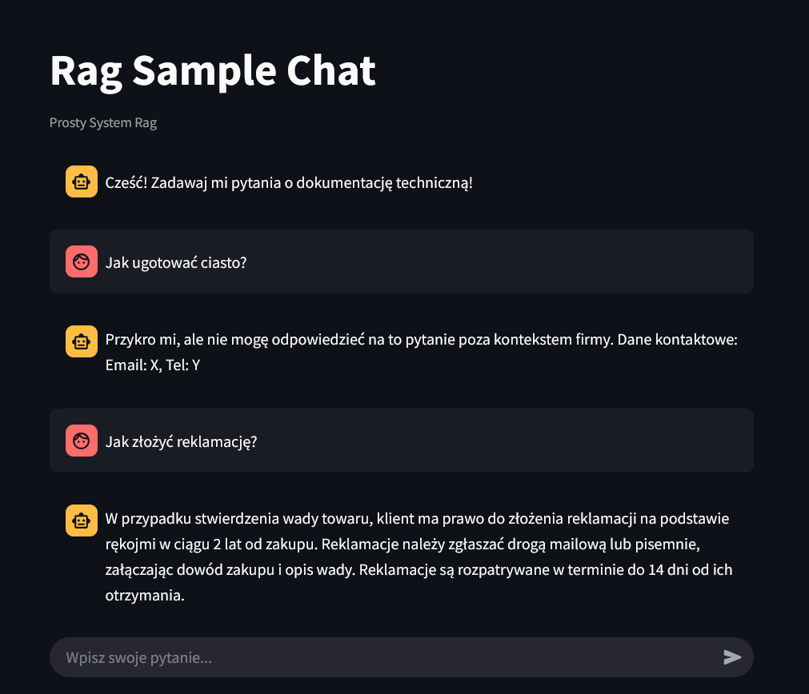

System RAG działający za pomocą streamlit, używający Bielik (wersja Mistral AI skupiona na języku polskim) jako swojego LLM. Jest to system bazowany na podstawie architektury github codespaces, co pozwala mu działać w podstawowej formie. Ma małe problemy z odpowiedziami.



Aby włączyć poprawnie system należy użyć w folderze /chat
```
pip install -r requirements.txt
```
Aby włączyć poprawnie system należy użyć w folderze /chat
```
streamlit run Chat.py
```
